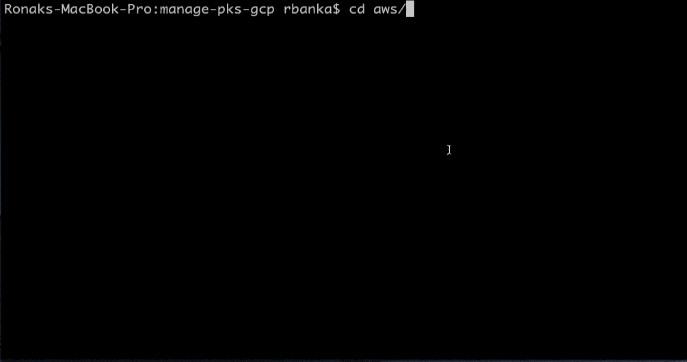

# Manage PKS on AWS

Automate Load balancer configuration & PKS cluster access on AWS.

## Demo


## What these scripts are not meant for (YET) !
* Automate PKS deployment on AWS
* Configure AWS cli

## Before you begin
**Assumption**: Infrastructure paving was done using [terraforming-pks](https://github.com/pivotal-cf/terraforming-aws).

* [PKS cli](https://docs.pivotal.io/runtimes/pks/1-3/installing-pks-cli.html)
* [AWS cli](https://docs.aws.amazon.com/cli/latest/userguide/cli-chap-install.html)
* [jq](https://stedolan.github.io/jq/download/)

### Instructions

1. Start by configuring PKS API access, please find detailed docs [here](https://docs.pivotal.io/runtimes/pks/1-3/configure-api.html).
  ```
  pks login -a PKS-API --client-name CLIENT-NAME --client-secret CLIENT-SECRET -k
  ```

2. Configure AWS cli to use your account

  ```
  $ aws configure
  AWS Access Key ID [None]: **************
  AWS Secret Access Key [None]: ***************
  Default region name [None]: ap-southeast1 (same as opsmanager region)
  Default output format [None]:
  ```
3. Configure
  ```
  export ENV_NAME=my-env (Same as terraforming-pks terraform.tfvars)
  ```
  ```
  export ROUTE_53_ZONE_ID=id (Zone Id which was used for PKS API)
  ```

4. Start by provisioning a new cluster, this step will invoke command to create new cluster .
  ```
  ./manage-pks provision
  ```
  and follow instructions. This step will:
  * Fetch the domain address from Route53 HostedZone
  * Create a cluster with hostname as `cluster_name`-k8s.your_domain


5. It will take some time to provision cluster, **check status with `pks cluster cluster-name` before proceeding to next step.**

6. Once cluster provision status is `succeeded`, enable access using
  ```
  ./manage-pks access
  ```
  and follow instructions. This step will:
  * Fetch the master instances Ids
  * Configure Security Group
  * Create load-balancer
  * Add master nodes to load-balancer
  * Configure the A record in hosted zone
  * Get credentials using PKS cli & set kubectl context


7. If you want to clean up AWS resources, Load balancer, security-group, A record in Hosted Zone
  ```
  ./manage-pks cleanup
  ```
  Above cleanup doesn't deletes the cluster itself, use `pks delete-cluster cluster_name`.
